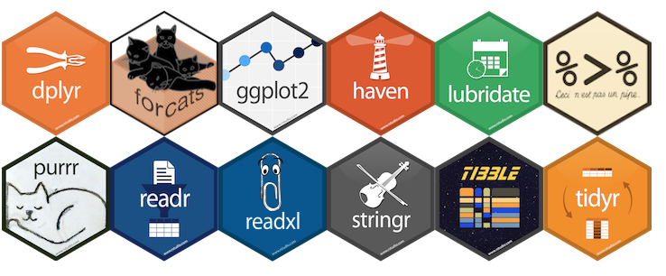

```{r setup, include=FALSE}
knitr::opts_chunk$set(echo = TRUE)
```

## Preamble

This page contains material for _Introducing R for criminologists_, a workshop hosted by the [Space Place and Crime](http://www.space-place-crime.eu/) working group at the European Society of Criminology conference in Ghent, 2019. Accompanying [worksheets and slides](https://rpubs.com/spaceplacecrime) are available.

## Introducing R and RStudio

As we discussed during the presentation, R is a programming language and open source software environment. Although it is widely used for statistics and data visualisation, R can be used for a variety of other tasks, such as text analysis, web scraping, mapping and spatial analysis, web dashboards and document preparation. Using R can drastically improve the efficiency of many research tasks through automation, and open up a variety of new tools that are not available in more 'traditional' software like Excel. Perhaps even more importantly, it will also make your research transparent and reproducible (both for yourself, and others).

Although R is available as a stand-alone piece of software, it is most commonly used through a user-friendly interface _RStudio_. We recommend that you first [download R](https://cran.r-project.org/bin/windows/base/) and then [download RStudio](https://www.rstudio.com/products/rstudio/download/). All the examples in this workshop will be done in _RStudio_. We'll cover (or have covered) the basics of the _RStudio_ interface during live demonstrations, but as a reminder, there are four main windows: the script editor, console, global environment and help/plots.

- **Script editor** This is where you will write and execute your code. Importantly, scripts can be saved, edited, re-used, even sent to other people for their own use. When you view data, it will appear in this window next to your script. You can open a new script by clicking the green/white plus symbol in a white box, on the very top left in RStudio, and selecting 'R Script'.
- **Console** When you execute code from the script, it will appear in the console. Depending on what you're doing, the output of your code might appear here too, such as the results of some analysis. It's not good practice to type and execute code into the console, because the code is not saved and cannot easily be returned to at a later date. That's why the script is useful!
- **Global environment** Although this window contains a number of tabs, the most important is the _environment_ (sometimes referred to as your 'workspace'). This will show whatever you happen to be working on, for instance, any data that you've loaded will be shown here, including a brief summary of whatever it is.
- **Plots/help** Any plots or graphics you create will automatically be shown in the _plots_ tab. You can cycle back through previous plots using the arrows. The _help_ tab contains a number of useful resources, such as links to cheat sheets and introductory manuals. We'll discuss packages a bit later, but the _packages_ tab contains a list of all the packages you've installed, including options to load or update them. You probably won't need the _files_ or _viewer_ tabs for now, but ask away if you're interested!


```{r, echo=FALSE}
knitr::include_graphics("./img/workspace.png")
```

## Starting a project

A lot of things in RStudio are easier if you work inside what's called a project. Projects let you keep all your R code for a particular piece of work self-contained, and mean you can switch between projects while keeping all the tabs in RStudio just as you left them. It's a good idea to always work inside a project if you are using RStudio.

To start a new project, click on _Project: (None)_ in the top-right corner of the RStudio window, then click _New Project ..._. Next click _New Directory_ then _New Project_. You can now choose a name for your project (we suggest _learn-r_) and a location for the project directory (folder) to sit on your computer. Finally, click _Create Project_ and the RStudio window will go blank briefly while the project is set up.

Complicated projects can end up generating lots of files, which can make your project directory cluttered. It may be helpful to create some directories inside your project directory to help organise your files. You can do this within R by copying the following text into the console and pressing `Enter`.

```{r, eval=F}
dir.create("scripts")       # a directory for the scripts your write
dir.create("original_data") # a directory for your original, *unchanged* data
dir.create("output_data")   # a directory for data you have created
dir.create("output_files")  # a data for other files you create, e.g. figures
```

## Objects and functions

We covered the basics of running code in the live demonstration. Code in R tends to be made up of two parts: functions and objects. Functions do things to whatever you input. This might be as simple as calculating the mean of a list of numbers. An object is anything that you create, and can take any form. A common example might be a data frame, but objects can also be things like a list of words, a single number, or a graphic. You can create an object by using the assign operator `<-`. Anything on the left hand side of `<-` will be the object that you are creating, and anything to the right is going to define what that object is, often through the use of a function. [Andy Field](https://uk.sagepub.com/en-gb/eur/discovering-statistics-using-r/book236067) summarises this as `object <- function`. You can read this as 'object is created from function'. You can call objects whatever you want, but it's good practice to give them meaningful names.

In the example below, we create an object without even using a function. Type (or copy) this into your script, highlight it (or click on the line of code) and hit `Ctrl + Enter` to execute it. For Mac, this shortcut is `Command + Enter`.

```{r}
city <- "Ghent"
```

The executed code will appear in the console. You'll notice that nothing else actually happens: all you've done is create an object called `city` which contains the word "Ghent". This object will appear in your global environment. If you want to print the contents of an object to the console simply execute the name of the object with `Ctrl + Enter`. For example:

```{r}
city
```

Be careful when typing: R is case-sensitive! It wouldn't recognise `City` or `CITY` even if the object `city` exists.

You can assign anything to an object. If we want to assign a series of numbers (or words), we use a similar concept to concatenate in Excel, simply to let R know that we are giving it more than one of something.

```{r}
my_numbers <- c(1, 2, 3, 4, 5, 6, 7, 8, 9) 
```

Functions can now be applied to this object. To find the mean, we can simply run:

```{r}
mean(my_numbers)
```

Although if you wanted to save the answer, you'd need to assign it to an object too. For example:

```{r}
mean_my_numbers <- mean(my_numbers)
```

You can remove objects from your global environment using the `rm()` function. Note that re-assigning something to an existing object with the same name will simply overwrite the original. So, if you don't want to lose anything, use new names for any new objects you create. The following would get rid of the `mean_my_numbers` object.

```{r}
rm(mean_my_numbers)
```

If you want to know more about a function, you can type `?` before the function name and then run the code. For example running `?mean` will bring up the help page for the function `mean` in the help/plot window in the bottom right of your interface.

### Note on types and classes

So far, we've been creating what are termed [vectors](http://adv-r.had.co.nz/Data-structures.html). Vectors are the most basic structure of data in R, and are simply just a collection of things which are the same type. You can check what type a vector is using the function `typeof()`, or the (more broad) class with `class()`. There are a few different types and classes of vector in R, and we recommend that you read this [article about object types](https://swcarpentry.github.io/r-novice-inflammation/13-supp-data-structures/) to understand them more.

A data structure you will be familiar with is a data frame. In R, you can think of a data frame as a list of vectors (i.e. columns, variables) of equal length (i.e. same number of rows). For instance, we can create a new data frame in a similar manner to how we created vectors above, but pre-specify we want to stick these together to create a data frame. This data frame has three variables (vectors, columns) of the same length (3 rows).

```{r}
example_df <- data.frame(var1 = c("id1", "id2", "id3"),
                         var2 = c(1200, 5444, 8333),
                         var3 = c("Ghent", "Manchester", "Los Angeles"))
example_df
```

We don't dwell too much on this here, but for now, it's important to be aware that the type of vector you are dealing with will dictate what you can do with it. It's the reason why we can calculate the mean of `my_numbers` or `var2` but not `city` or `var3`, for instance. Whilst this might seem obvious, it's worthwhile being aware of these different types and classes. You can complete the exercises today without looking at the reading links above, but we recommend you return to it later on.

## Installing packages

R comes with a huge amount of built-in functionality. You can load, manipulate, analyse and visualise data simply with the tools you have already upon download. That said, the real power and versatility of R comes with additional _packages_ which you can install (for free) from within the software. There are thousands of R packages out there, but there is a specific group of packages which have been designed around a common philosophy, and can be used in conjunction with one another. Collectively these are referred to as the `tidyverse`. You can read more about the tidyverse in the (legitimately) free book [R for Data Science](https://r4ds.had.co.nz/), which covers the fundamentals of data science in R.

```{r, out.width = "800px", echo = F} 

```

To install the tidyverse in R, you can run the following code. Once installed, you tend not to have to reinstall packages, so this is a rare occasion when you can simply type or copy and paste the code into the console and hit `Enter`, rather than typing it into the script editor. Because the tidyverse is quite extensive, containing a number of packages, the install may take a few minutes.

```{r, eval = F}
install.packages('tidyverse')
```

A summary of what has been installed will appear in the console. Warnings in red are not always bad, and we will cover them more in the live demonstration. You now have the tidyverse installed!

Usually you'll download packages because they contain useful functions which allow you to do something, like analyse or visualise data, but packages often also contain data. You'll have got a few with the tidyverse, but they are not crime specific. Lucky for you, [Matt Ashby](http://lesscrime.info/) has released a package called `crimedata` which contains lots of open data about police recorded crime from a number of large cities in the United States. We will use this later, so whilst we're here, install this package by editing the `install.packages()` code above.

## Loading packages

Installing packages is a one-time thing, but each time you open a new session in R, you need to load the packages you want to use. You can do this by ticking the box of whichever one you want to load in the _packages_ tab of the help/plots window. However, it is good practice to load packages using code. You can do this using the `library()` function. Copy the following to load the tidyverse, then do the same for the `crimedata` package. Like this:

```{r, warning=F, message=F, results=F}
library(tidyverse)
library(crimedata)
```

## Loading in data

Most of the time, you are going to be loading in your own data. This might be stored in a variety of formats, such as .dta or .sav depending on what software you are currently using, or you might have geographic data (for example .shp files). The chances are that R can load them, it just might require a different function.

A common format for storing data frames is .csv so that's the example we're going to use here. We're going to use the `read_csv()` function from the `readr` package within the tidyverse and assign the data to a new object. The contents of this function will be where the data is stored. If it's online, this will be a url, but if it's on your local drive, then it will be a working directory. I've put some data on github for this workshop, so we can load it simply by running this, using the url where the data is stored.

```{r, message = F}
stops <- read_csv("https://github.com/langtonhugh/ESC2019_materials/raw/master/2018-12-greater-manchester-stop-and-search_edit.csv")
```

This will create an object called `stops`, but you can call it whatever you want. You'll notice that a summary of this object will appear in your global environment. If you want to save the data for later use offline, first download the file to a local drive. You can do this manually, by following the link and saving as you might normally, but you can actually download the data within R using `download.file()`. The first 'argument' called `file` tells R where the data is, and the second argument `destfile` tells R where to save the data and what to call it. If you are working inside an RStudio project, the file location specified in `destfile` is relative to your project directory, which keeps everything self contained.

```{r, eval = F}
download.file(url = "https://github.com/langtonhugh/ESC2019_materials/raw/master/2018-12-greater-manchester-stop-and-search_edit.csv", destfile = "original_data/stops-data.csv")
```

It's always a good idea to store an unaltered copy of any data on your computer, just in case the original version is later removed from the website you downloaded it from.

Once you've downloaded the file, load it in the same way using `read_csv()` but this time use the working directory where you saved the file.

```{r, eval = F}
stops <- read_csv(file = "original_data/stops-data.csv")
```

## Basic exploration

Once you've loaded data into R (whichever way you've done it above), there's a few useful functions you can use to explore it a bit. Try each of these one at time and review the outcome. You'll notice that we've added comments after each line of code below as a brief explanation. Anything you write after a `#` is treated as a comment and is ignored by R when running chunks of code. It's useful to add comments as you go when writing code, explaining what you are doing and why. You will thank yourself for doing this when returning to code you wrote months earlier.

```{r, eval = F}
head(stops)         # Print the top 6 rows (i.e. observations) 
tail(stops)         # Print the bottom 6 rows
View(stops)         # View the data in a new window
sum(is.na(stops))   # Count missings in the data frame
nrow(stops)         # Number of rows
ncol(stops)         # Number of columns
summary(stops)      # Basic descriptives of each variable
```

We'll be making use of the `$` sign to generate descriptives about specific vectors (variables) within a data frame. To refer to a specific variable, you need to state the data frame object and then the variable name using this `$` symbol. So, to count the number of missing for a specific variable `age` in `stops` you would run:

```{r, eval = F}
sum(is.na(stops$age)) # There are 136 missings in the age variable
```

Or to print a basic cross-tabulation by two variables:

```{r, eval = F}
table(stops$age, stops$type)
```

As we'll see, one of the benefits of using the tidyverse is that you often don't need to use `$`, which can look quite messy, but it's definitely worth knowing.

## Data wrangling

So far, we haven't really made much use of the tidyverse, but the some of the most useful functions are coming up. They are often termed 'verbs' because the function name corresponds more or less to what it's _doing_ to the object. We are going to cover some of the most common:

- `filter()` to choose rows in a data frame by one or more conditions
- `select()` to choose columns by name
- `arrange()` to order rows according to the values of one or more columns
- `slice()` to choose rows by row number
- `rename()` to rename variables
- `mutate()` to create new variables

### Filter

We'll be using the stop and search data again for this. Let's say we are only interested in stop and search incidents in which the individual was arrested. We can filter the `outcome` variable by 'Arrest' and assign the new data frame to a new object. The first argument of `filter()` is the data frame, and the second is the condition. In this example we can do:

```{r}
stop_arrests <- filter(stops, outcome == "Arrest")
```

Take a look at this new object using the `View` function.

```{r, eval = F}
View(stop_arrests)
```

### Select

In some cases, you might only be interested in a small number of variables. Here, we select only the gender, age and ethnicity of the individual, along with the outcome of the stop and search, and create a new data frame. Again, the first argument is the data frame object, and the remaining are optional ones specifying the names of the variables.

```{r}
stops_subset <- select(stops, gender, age, ethnic, outcome)
```

If you are interested in all but one or two variables, it's easier to specify what you _don't_ want rather than what you _do_ want. Here, we are not interested in the legislation used for the stop and search. Notice that by assigning this new `select()` function to an object `stops_subset` we are overwriting the original. It doesn't matter here, but it's worth remembering. Generally speaking, it's best to try and _not overwrite any existing objects_ unless having too many is slowing your computer down. By keeping them all, you retain a trail of everything you've done, and can go back to old objects later on.

```{r}
stops_subset <- select(stops, -legislation)
```

### Arrange

To order the rows of a data frame, we can use `arrange()`. So, for example, if we want rows to appear in chronological order by day from top to bottom, we can run:

```{r}
stops_ordered <- arrange(stops, day)
```

Or to order in descending order (note that we are overwriting the existing object again):

```{r}
stops_ordered <- arrange(stops, desc(day))
```

### Slice

You might want to select a specific set of observations using `slice()`. This is especially useful if you have your data in a meaningful order. Here, we just use it to demonstrate selecting the first 10 rows of the `stops` data frame. We are using the `:` symbol to denote a sequence from 1 to 10.

```{r}
stops_first10 <- slice(stops, 1:10)
```

### Rename

Often, data has variables with excessively long names, or names which are not clear. The data here is not that bad, but some might need changing. For example `clothing_rm` tells us whether clothing had to be removed as part of the stop and search, but this might not be clear to some people. The `rename()` function makes changing variable names fairly easy.

```{r}
stops_renamed <- rename(stops, clothing_remove = clothing_rm)
```

### Mutate

To simplify or ease interpretation, you might want to create a new variable. This new variable might be entirely new, or a construction from an existing variable. This is where we can use the `mutate` function. 

In the first example, let's say we want to create an ID column for the `stops` data frame, whereby each row is assigned a number for the purposes of identification. Note that we make things a bit easier for ourselves here by using the `nrow()` function from earlier, instead of manually stating the number we need. We also use a colon `:` again to dictate that we want a sequence to run from 1 to the number of rows in `stops`. We are calling the new variable 'ID'.

```{r}
stops_with_id <- mutate(stops, ID = 1:nrow(stops))
```

### Mutate + recode

More commonly, you are going to recode existing variables to create a new one. Let's say we just want a two category variable indicating whether the individual was below 18. We need to combine categories in the `age` variable to do this. You'll notice that we are sandwiching the original categories with backward apostrophes (`). This is something that is needed when you are referring to variable categories or variable names which either _have spaces_ or _begin with a number_. This kind of thing will take a while to get used to, but once you are used to these little rules, they will become second nature.

```{r}
stops <- mutate(stops, age_recode = recode(
  age,
  `10-17`    = "Below 18",
  `18-24`    = "Over 18",
  `25-34`    = "Over 18",
  `over 34`  = "Over 18",
  `under 10` = "Below 18"
))
```

The new variable `age_recode` has now been created and appended to the `stops` data frame.

## Piping

You have now learnt a bit about some key verbs within the tidyverse. You'll have noticed that the first part of each function is the data frame object. For example, `stops_ordered <- arrange(stops, day)` is creating a new object called `stops_ordered` which is `stops` ordered by `day`. In more complex scripts, this can get quite repetitive and make your code unnecessarily long. There is a useful feature in the tidyverse `%>%` which allows you to 'pipe' the data frame through multiple lines of code, and through multiple verb functions. Using the pipe can make your code tidier and more concise.

In a basic example, we can rewrite the above `arrange` example using a pipe.

```{r}
# This:
stops_ordered <- arrange(stops, day)

# Does exactly the same as this:
stops_ordered <- stops %>% arrange(day)
```

As it stands, this isn't really more efficient. However, as soon as we start doing more complex things, you will see the benefits. The below example uses some of the tidyverse verbs we have introduced so far, but in one single chunk of code, and with only one mention of the `stops` data frame object. We've snuck in a new function at the end of this pipe to drop all rows that contain a missing value.

So, the following code takes the original `stops` data frame, subsets it by individuals who were arrested, selects a small number of important variables, renames a variable and drops observations with missing values, all in one chunk of code. The output of this is assigned to a new object called `stops_piped`. It is good practice to put each part of the pipe on a new line, so it's easier to read.

```{r}
stops_piped <- stops %>%                    
  filter(outcome == "Arrest") %>% 
  select(gender, age, ethnic, outcome, legislation) %>% 
  rename(ethnicity = ethnic) %>% 
  drop_na()
```

So there we have it: a basic introduction to verbs in the tidyverse. This is not an exhaustive list of the functions available to wrangle data. There are plenty more, all of which are compatible with piping to make your code clear and efficient, but these will get you started.

## Visualisation

### Step-by-step

There is more to visualisation than pretty graphs: they are an integral part of your workflow and form a fundamental part of [how the tidyverse is designed](https://www.r-bloggers.com/what-is-the-tidyverse/). Visualisations can be a quick way to get a feel for your data before delving into statistical modeling, but they can also be a powerful way to make your findings accessible and more easily interpretable for other researchers or the public.

Arguably the most powerful and popular package within the tidyverse is `ggplot2`. This package is based on a tool called the [grammar of graphics](https://vita.had.co.nz/papers/layered-grammar.html) which provides a framework for creating visualisations that move beyond the typical way of thinking about graphics. A fundamental component of this is the idea that graphics are made up for _layers_. Three of the most important layers in visualisations are the data, the aesthetics and the geometries ('geoms').

```{r, echo = F}
knitr::include_graphics("https://www.science-craft.com/wp-content/uploads/2014/06/ggplot-1.png")
```

- **Data** The first layer is the data itself, which would typically be a data frame with rows and columns, just like we've been dealing with so far.  
- **Aesthetics** These describe the visual characteristics that represent the data you are interested in, such as colour, size and shape.
- **Geoms** These describe the objects that represent the data, such as points or lines.

When you are creating graphs using `ggplot2` you can build the graph up using these layers. It is a different way of thinking about graphs compared to, say, using a template for a plot in Excel, but over time it will be intuitive and allow you to make high quality visuals quite quickly. The concept is demonstrated in R using the example below.

### Banning orders

Let's take a look at an example using some data on [football banning orders](https://www.inbrief.co.uk/football-law/football-banning-orders/) for some football clubs in England. As previously, we will download a copy of the data using `download.file()` and then load that copy into R using `read_csv()`, so we have a copy if the original ever disappears from the internet.

```{r, warning = F, message = F}
download.file(url = "https://github.com/langtonhugh/ESC2019_materials/raw/master/banning_orders.csv", destfile = "original_data/bans-data.csv")

bans <- read_csv(file = "original_data/bans-data.csv")
```

We are going to build a basic graphic up from scratch using the three layers: data, aesthetics and geometries. Our aim is to examine the distribution of banning orders by different English leagues. This will involve the variable `Banning Orders` and the variable `League of the Club Supported`. A common way to examine distributions is a boxplot, so that's what we are going to do.

Code for plotting using `ggplot2` is actually written in the order in which these layers are made, building from the main function `ggplot`. We can begin by just plotting the first layer: the data.

```{r}
ggplot(data = bans)
```

As you can see, nothing happens apart from the plot window has gone grey. Okay, it is the first layer of our graphic, but we need to add the aesthetic layer. We do this using the `mapping` argument. Aesthetics define the axis of your graph. Since we are interested in how banning orders vary by league, these two variables will be our axis. Note the use of the back ticks again because our variable names have spaces.

```{r}
ggplot(data = bans,
       mapping = aes(x = `League of the Club Supported`, y = `Banning Orders`))
```

We've now plotted the data and aesthetics. You'll see in the plot window that we now have the basic layout of the graph. The last fundamental component are the geoms. In this case, it is a boxplot, so we are going to add the geoms using the `geom_boxplot` function. There many, many different types of geoms which we can explore later. Note the use of the `+` symbol when we add another layer. This behaves very similarly to the ` %>% ` mentioned earlier. We will cover this more in the live demonstration, and later in the exercises.

```{r}
ggplot(
  # Specify the data
  data = bans,
  # Specify the aesthetics to represent the data
  mapping = aes(x = `League of the Club Supported`, y = `Banning Orders`)) +
  # Specify the geometry to display the aesthetics
  geom_boxplot()
```

There we have it: the distribution of banning orders by league!

It's worth being aware that ggplot code can be constructed differently, depending on what you are doing, or what you think makes your code clearer. We can write `geom_boxplot()` with no information inside the brackets because we have already specified the aesthetics. If you do this (i.e. specify the aesthetics first within the `ggplot` function) then any subsequent geoms will have that same mapping. Sometimes, this might conflict with what you are doing, so it's worth remembering that you could create the above plot using the following.

```{r, eval = F}
ggplot(data = bans) +
  geom_boxplot(mapping = aes(x = `League of the Club Supported`, y = `Banning Orders`))
```

Some examples you'll see online might be structured like this. It can be more flexible when you want to specify geoms with different aesthetics in the same plot. Use whichever one is comfortable and works for you.

### US crime data

A quick demonstration using the data from the `crimedata` package shows us how we can map additional variables onto our visuals using aesthetics beyond the classic x and y. First, check you have installed and loaded the package, as outlined earlier in this exercise.

You can load in some open crime data using the `get_crime_data()` function from the package. Let's just get the core data for 2017 for all the cities available. This might take a few moments on download.

```{r, warning = F, message = F, results=F}
crimes <- get_crime_data(years = 2017, type = "core")
```

Take a look at the data using `View(crimes)` or use some of the basic exploratory functions we introduced at the beginning to get used to what the data looks like. You'll notice that each row is a recorded crime, with associated information like the city in which the crime occurred, the offence type, and the census block in which the crime occurred. From this, we know the data is nested: crimes within census blocks, census blocks within cities.

First, let's just subset the data by a crime type (disorderly conduct), and drop cases that are missing if we don't know the location category, as we are going to use it later. We assign this new data frame to the object `dis_con`.

```{r}
dis_con <- crimes %>% 
  filter(offense_type == "disorderly conduct") %>% 
  drop_na(location_category)
```

We can now make a quick bar chart of crime counts for each city. Note how we don't actually need to calculate these counts ourselves: if you don't specify a y-axis variable in a bar plot, ggplot will just assume you want counts, which is a pretty common use for bar charts. We introduce some new options here: `coord_flip()` rotates the chart, `labs` allows you to change various different label names, and `theme_bw()` adds a pre-set [ggplot theme](http://www.sthda.com/english/wiki/ggplot2-themes-and-background-colors-the-3-elements) to the graph.

```{r}
ggplot(data = dis_con, mapping = aes(x = city_name)) + # set data and aesthetics
  geom_bar() +                                         # set geom
  labs(x = NULL,                                       # remove x-axis label
       y = "count of crimes",                          # optional labels
       title = "Counts of disorderly conduct",
       subtitle = "United States, January to December 2017",
       caption = "Source: Crime Open Database") +
  coord_flip() +                                       # flip the plot
  theme_bw()                                           # add a new theme
```

Let's say we want to see how the location of disorderly conduct incidents varies by city. We can map the `location_category` variable (which now has no missings) using the `fill` aesthetic. Note the minor changes to the labels.

```{r}
ggplot(data = dis_con, mapping = aes(x = city_name, fill = location_category)) +
  geom_bar() +
  labs(x = NULL,
       y = "count of crimes",
       title = "Counts of disorderly conduct",
       subtitle = "United States, January to December 2017",
       caption = "Source: Crime Open Database",
       fill = "Location category") +  # new label for the fill aesthetic
  coord_flip() +
  theme_bw()
```

For the final example, we are going to combine it with a bit data wrangling. This introduces some new verbs: `group_by()` groups observations by whatever variables are specified. Any subsequent functions are performed on the groups rather than each observation. `tally` is just a way of summing the number of observations, in this case, by group. By way of example, the following will print out the number of observations (i.e. in this case, crimes) by each city.

```{r}
crimes %>%
  group_by(city_name) %>%
  tally(name = "crime_counts") # We specify the name of the new variable too.
```

For the next visualisation, however, we want to sum the number of crimes by census block for each city. So, we have to group by two variables, otherwise we lose the information about which census block is in which city. We also filter out outliers, which we've just decided are any counts greater than 20. This is arbitrary and just for the purposes of the demonstration!

```{r}
block_counts <- crimes %>% 
  group_by(city_name, census_block) %>% # Group by city and census block
  tally(name = "crime_counts") %>%      # Counts (by city and census block)
  filter(crime_counts <= 20)            # Exclude counts greater than 20
```

Take a look at the data now with `View(block_counts)`. We now have a count of the number of crimes for each census block by city.

We can now plot these data to show how concentrated crime is in each city. Here, we make a density plot, but split the plot into [small multiples](https://www.dshkol.com/2017/small-multiples-with-maps/) by city using the `facet_wrap()` function. You'll also notice that we also specify the fill as black, but not as an aesthetic. Aesthetics are mapped to variables! Here, we are not mapping `fill` to a variable, just stating that it should be black.

```{r}
ggplot(data = block_counts, mapping = aes(x = crime_counts)) +
  geom_density(fill = "black") +
  facet_wrap(~ city_name) +
  theme(legend.position = "none")  # remove the legend, since it only has one value
```

The possibilities are nearly endless with ggplot2 but we've introduced you to a few of the key concepts. The best way to get proficient at visualising using ggplot is to practice, ideally with your own data. Sketch out what you want to achieve, thinking about what structure the data will have to be in to achieve what you want, and which aesthetics are going to be meaningful to get your message across.

## Saving data frames

Just as R is capable of importing numerous different types of data (e.g. .csv, .dta, .sav amongst others), it can also save data in many formats. We will demonstrate how to save the `block_counts` data frame object, used above, as a .csv file using `write_csv()`. We'll need to specify the data frame object we want to save, and the directory where we want to save the file, with the file name at the end. As with reading data, data you save will be saved within your project directory.

```{r, echo = T}
write_csv(block_counts, path = "output_data/block_counts.csv")
```


## Saving visuals

So far, when we've created a graphic, we haven't been assigning it to an object, so everything has just appeared in the plot window. If we want to save a graphic, we need to assign it to an object, and then use the `ggsave()` function. We've chosen a .jpeg but there many [other options](https://ggplot2.tidyverse.org/reference/ggsave.html). You can use the example below as a template.

```{r, eval = F}
p1 <- ggplot(data = block_counts, mapping = aes(x = crime_counts)) +
        geom_density(fill = "black") +
        facet_wrap(~ city_name) +
        theme(legend.position = "none")

ggsave(filename = "output_files/my_plot.jpeg", plot = p1, device = "jpeg")
```

## Useful resources

1. **R for Data Science** This [free book](https://r4ds.had.co.nz/) gives you a comprehensive introduction to the tidyverse. The material in that book will allow you to do the vast majority of fundamental data tasks in R, including everything we've done in this tutorial. It is available quite cheaply as a paperback too.  
2. **Google** This is probably your best resource! Queries will often take you to great websites like Stack Overflow, where in 99% of cases, someone has asked exactly the same question you have! To get an answer that uses the tidyverse, follow every Google search with the word 'tidyverse' or the specific package within the tidyverse (e.g. ggplot2) if you know which one it is.   
3. **Twitter** To broaden your knowledge of R more generally, or to keep up-to-date with the latest developments, Twitter is a great resource. There are few key people, such as [Hadley Wickham](https://twitter.com/hadleywickham?ref_src=twsrc%5Egoogle%7Ctwcamp%5Eserp%7Ctwgr%5Eauthor), [Mara Averick](https://twitter.com/dataandme?ref_src=twsrc%5Egoogle%7Ctwcamp%5Eserp%7Ctwgr%5Eauthor), [Julia Silge](https://twitter.com/juliasilge?lang=en) and [Thomas Lin Pederson](https://twitter.com/thomasp85?lang=en), who are definitely worth following, but there are many others who you will come across. The hashtag [#rstats](https://twitter.com/search?q=%23rstats) also showcases great graphics and other work people have done with R.

<!-- ## Acknowledgements -->
