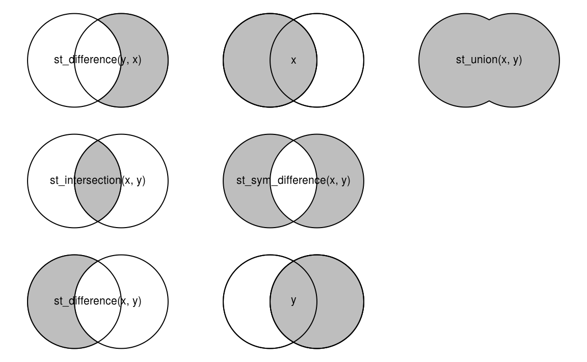

```{r setup, include=FALSE}
knitr::opts_chunk$set(echo = TRUE)
```

```{r, warning=F, message=F, results=F, echo = F}
library(tidyverse)
library(crimedata)
library(sf)
```

## Preamble

This page contains material for _Introducing R for criminologists_, a workshop hosted by the [Space Place and Crime](http://www.space-place-crime.eu/) working group at the European Society of Criminology conference in Ghent, 2019. Accompanying [worksheets and slides are available](https://rpubs.com/spaceplacecrime). For this afternoon session, it assumed you have some background in geography and/or GIS software.

## Spatial data in R

Although there many high-quality open-source GIS software out there (e.g. QGIS, GeoDa) R has a huge breadth of functionality for spatial data handling, analysis and visualisation. It's worth mentioning before we begin that spatial analysis and mapping in R is designed around two packages: `sp` and `sf`. The story of spatial data in R began with sp, which defined the formats and various workings of how to make maps and perform spatial analysis. Although it is still important and widely used, sf (which stands for [simple features](https://cran.r-project.org/web/packages/sf/vignettes/sf1.html)) marked somewhat of a revolution. It is consistent with many aspects of the `tidyverse`, covered this morning, and is the future of mapping in R. For this reason, this tutorial focuses almost exclusively on sf. However, you might find that some tools are still only compatible with sp. As we'll demonstrate, it is very straightforward to convert between the two, but it's worth knowing that both exist! There's an interesting [blog post comparing the two](https://www.r-bloggers.com/should-i-learn-sf-or-sp-for-spatial-r-programming/).

## Open your RStudio project

Open the RStudio project that you worked within this morning. When you open it, any script files you had open when you last closed the project should open automatically. Note that the Console panel (bottom left) and the Environment panel (top right) are blank. This is why we recommend writing your code in a script, which is saved between sessions, rather than the console. It is also why we saved the results of our work this morning in the `block_counts.csv` file: if we had not saved the data we created, we would have lost it.


## Install and load packages

You will know how to install and load packages from this morning. Use `install.packages()` to install `sf` and then load it using `library()`. Make sure you have the `tidyverse` and `crimedata` packages installed and loaded too. 

## Visualisation with sf

### Stop and search example

We'll begin with a brief demonstration of how your existing tidyverse skills (from this morning) are transferable to working with spatial data in R. First, let's load in the stop and search data from earlier.

```{r, message = F}
# If you have deleted the file stops-data.csv that you downloaded this morning,
# or you are working on another computer, you can download it again before
# opening
download.file(url = "https://github.com/langtonhugh/ESC2019_materials/raw/master/2018-12-greater-manchester-stop-and-search_edit.csv", destfile = "original_data/stops-data.csv")

# otherwise, you can just load the file that you downloaded this morning
stops <- read_csv(file = "original_data/stops-data.csv")
```

As it stands, the object `stops` (or whatever you have called it) is a 'traditional' rectangular data frame. However, it does contain spatial data: the columns 'latitude' and 'longitude' tell us where the stop and search was conducted. But at the moment, R does not recognise them as spatial, they are just two numeric columns. You couldn't map these locations out in any meaningful way. To make this conversion, we will make use of the sf package. We can convert this data frame into a spatial object.

We do this using the `st_as_sf()` function within the sf package (slightly confusingly, the names of functions from the `sf` package typically start with the letters `st_`). In doing so, we need to specify what columns are our coordinates, and specify the coordinate reference system (CRS), just as you might with any other GIS software. Before that, we need to drop the stop and search incidents which do not have one or both lat-long coordinates.

```{r}
stops <- stops %>% 
  drop_na(latitude, longitude)
```

Then we can make the conversion. Note that all we need to do is specify the data frame we are using, the columns which are going to become our coordinates, and the EPSG code of the raw data. [EPSG codes](https://www.puzzlr.org/epsg-codes-explained/) describe different co-ordinate reference systems; for example, the WGS 84 CRS used by services such as Google Maps uses the EPSG code 4326.

```{r, message = F}
stops_sf <- st_as_sf(stops, coords = c(x = "longitude", y = "latitude"), crs = 4326)
```

Although we had to specify the CRS of the raw data when loading it in, we can transform it quite easily. Here, we transform to the [British National Grid reference system](https://en.wikipedia.org/wiki/Ordnance_Survey_National_Grid) (EPSG code 27700) for easier use later on.

```{r}
stops_sf <- st_transform(stops_sf, 27700)
```

Now, we've created a new object `stops_sf` which contains all the data contained within `stops` but it now has spatial attributes. When you view the object using `View(stops_sf)` you will notice that there is a new column called 'geometry' containing the coordinates for each observation. We can now make a basic plot, which in this case, maps out the spatial distribution of stop and search incidents recorded by Greater Manchester Police in December 2018. We can do this using the same skills in ggplot which we learnt this morning. In fact, because ggplot recognises the spatial attributes of sf objects automatically, with the geometry option `geom_sf()` we don't even need to specify the coordinates of the data.

```{r}
ggplot(data = stops_sf) +
  geom_sf()
```

```{r, message = F, warning=F, echo = F, results=F}
download.file(url = "https://github.com/langtonhugh/ESC2019_materials/raw/master/manc_msoa_shp.zip",
              destfile = "./data/manc_msoa_shp.zip")

unzip(zipfile = "./data/manc_msoa_shp.zip",
      exdir = "./data")

manc_sf <- st_read("./data/manc_msoa_shp/england_msoa_2011.shp")
```

There appears to be some interesting spatial patterning to these locations, but the picture is skewed somewhat by some outliers which are not actually within the boundaries of Greater Manchester Police. These will need clipping to whatever study area we are interested in.

The shapefiles for various different geographic boundaries in the UK are available from the UK Data Service. For this exercise, we've compiled a shapefile for the city of Manchester's neighbourhoods, defined broadly as [Middle Super Output Areas](https://www.ons.gov.uk/methodology/geography/ukgeographies/censusgeography) (MSOA).

### Download data

The neighbourhood boundaries are stored in a zip file, so we will download that file, unzip it and load the boundaries into R. Although you could do the first two steps manually, if you do them in R then you can run the code again almost instantly if you need to repeat it for any reason.

First, we download the file

```{r, message = F, warning=F, eval = F}
download.file(url = "https://github.com/langtonhugh/ESC2019_materials/raw/master/manc_msoa_shp.zip", destfile = "original_data/manc_msoa_shp.zip")
```

We can then unzip the file from within R by specifying where the zipped folder is, and where we'd like the unzipped folder to be placed. Since we do not need to take up space on our computers by storing both the zipped and unzipped boundaries, we will store the unzipped files in a temporary directory that will be deleted when we close RStudio.

```{r, message = F, warning=F, eval = F}
unzip(zipfile = "original_data/manc_msoa_shp.zip", exdir = tempdir())
```

### Read a shapefile

Now we have an unzipped folder containing the shapefile, you can load in the shapefile using `st_read()` from the sf package, and assign it to a new object.

```{r, message = F, warning=F, eval = F}
# to see what files were unzipped from the zip file, use unzip(list = TRUE)
unzip(zipfile = "original_data/manc_msoa_shp.zip", list = TRUE)

# now load the shapefile
manc_sf <- st_read(paste0(tempdir(), "/manc_msoa_shp/england_msoa_2011.shp"))
```

When you do this, you will get some messages about what you are loading in, including the geometry type, projection and the number of features (observations i.e. MSOAs) and fields (variables). These will likely be familiar if you have used other GIS software before.

To take a peak at what MSOAs in Manchester look like in relation to the stop and search incident locations, we can plot one over the other. First, we'll ensure that our new object manc_sf has the same CRS as stops_sf.

```{r}
# grabs CRS of stops_sf, and assigns it to manc_sf
manc_sf <- st_transform(manc_sf, st_crs(stops_sf)) 
```

Then make the plot.

```{r}
ggplot() +
  geom_sf(data = manc_sf, fill = "black") +            # Fill in polygons black
  geom_sf(data = stops_sf, colour = "red", size = 0.5)  # Colour dots red and make them smaller than default
```

### Intersection

If we are only interested in stop and search incidents that occur in Manchester city i.e. within the black polygons, we can conduct an intersection. Intersection commands take two spatial datasets and do two things: first, remove any features in the first dataset that do not spatially overlap with the second dataset and second, join all the attributes of the second dataset to each feature in the first dataset.

```{r, message = F, warning=F}
stops_clip_sf <- st_intersection(stops_sf, manc_sf)
```

Now we can generate more meaningful plots of the spatial distribution of stop and search incidents in Manchester city, including additional variables, like the object of the stop and search.

```{r, eval = F}
# Basic clipped plot
ggplot() +
  geom_sf(data = manc_sf) +
  geom_sf(data = stops_clip_sf)

# Including object of search
ggplot() +
  geom_sf(data = manc_sf) +
  geom_sf(data = stops_clip_sf, mapping = aes(fill = objectofsearch), pch = 21)
```

```{r, echo = F, out.width="800px", warning = F, message=F}
library(cowplot); theme_set(theme_grey())

p1 <- ggplot() +
  geom_sf(data = manc_sf) +
  geom_sf(data = stops_clip_sf) +
  labs(title = "Basic clipped")

p2 <- ggplot() +
  geom_sf(data = manc_sf) +
  geom_sf(data = stops_clip_sf, mapping = aes(fill = objectofsearch), pch = 21) +
  labs(title = "Search object clipped")
leg <- get_legend(p2)

p3 <- ggplot() +
  geom_sf(data = manc_sf) +
  geom_sf(data = stops_clip_sf, mapping = aes(fill = objectofsearch), pch = 21) +
  labs(title = "Search object clipped") +
  theme(legend.position = "none")

plot_grid(p1, p3, leg, nrow = 1)

```

### Aggregating data

As noted above, not only does the intersection function clip points, but it will also append the MSOA-level data (i.e. polygon attributes) to the point-level stop and search incident data. We can now identify which stop and search incidents occurred in which MSOA. A benefit of this is that we can easily create an MSOA-level measure of stop and search concentrations by creating a count by MSOA in a new data frame.

```{r}
manc_stops <- stops_clip_sf %>% 
  # Count the number of rows with each value of code, creating new variable 
  # stop_counts
  count(code, name = "stop_counts") %>%
  # Remove geometry column
  st_set_geometry(NULL)              
```

Note that the new object `manc_stops` is now at MSOA-level, with one row per MSOA, and a count for each one. However, you will notice that the above has excluded those MSOA which did not contain any stop and search incidents, because there was no data to aggregate. We can resolve this by joining the aggregated data frame `manc_stops` back with the original sf object `manc_sf`. You can [read more about joins](https://rpubs.com/williamsurles/293454). Non-matching MSOAs are those in which there were no stop and search incidents, so we replace those missing counts with a zero.

```{r, warning = F, message = F}
manc_sf <- manc_sf %>% 
  left_join(manc_stops, by = "code") %>% 
  replace_na(list(stop_counts = 0))
```

This allows us to make an MSOA-level area visual of stop and search counts in Manchester, highlighting how concentrated searches are in the city centre.

```{r}
ggplot(data = manc_sf) +
  geom_sf(mapping = aes(fill = stop_counts))
```

We can make a few tweaks using standard ggplot functionality to improve the appearance of this map.

```{r}
ggplot(data = manc_sf) + 
  geom_sf(mapping = aes(fill = stop_counts)) +
  theme_minimal() +
  scale_fill_continuous(low = "snow", high = "red") +
  labs(title = "Stop and search incidents",
       subtitle = "Middle Super Output Areas, \nManchester, December 2018",
       fill = "counts",
       caption = "Data from www.police.uk")
  
```

### Spatial joins

For other purposes, we might to conduct a spatial join, which will append our point-level data with aggregate-level MSOA data, based on which neighbourhood the stop and search incidents occurred in. You'll notice that this has similar functionality to the intersection, but with a join this way around, instead of dropping points outside of any polygons, they are simply missing on the `manc_sf` attributes for those points outside of the polygon object. You can check those that are missing by viewing the data manually with `View(stops_joined_sf)`.

```{r}
stops_joined_sf <- st_join(stops_sf, manc_sf)
```

## Geometry operations

### Clip

We have covered clipping above using the `st_intersection()` function but there are various different types of clip one can use. In the above example, we used the most common, whereby points are cropped to only include those within a set of polygons. However, there are many more that might be relevant for your research included within the `sf` package. Below is a useful graphic from [Geocomputation in R](https://geocompr.robinlovelace.net/) which summarises the various different options available for various purposes.

```{r, echo = F, fig.cap= "Source: Geocomputation in R (Lovelace, Nowosad & Muenchow, 2019)"}

```

### Simplify

Often, polygon data can be so detailed it is computationally intensive, or can make visualisations too complex. In such circumstances, you can simplify polygons to different degrees of tolerance. Here, we've used quite a conservative tolerance level to simplify the neighbourhoods of Manchester city without introducing too much distortion. You might want to fiddle around with the tolerance to get something that suits your aims.

```{r}
manc_simp_sf <- st_simplify(manc_sf, dTolerance = 120) # 120 metres
```

```{r, echo = F, warning=F, message=F}

p1 <- ggplot(manc_sf) + geom_sf() + labs(title = "Original polygons")
p2 <- ggplot(manc_simp_sf) + geom_sf() + labs(title = "Simplified polygons")

plot_grid(p1, p2, nrow = 1)
```
  
You'll notice that if you increase the tolerance too much, polygons begin overlapping or moving apart from one another. An alternative method which avoids this is [in the `rmapshaper` package using `ms_simplify()`](https://cran.r-project.org/web/packages/rmapshaper/vignettes/rmapshaper.html).

There are more extreme methods of simplifying polygons, such as tiled or hexagonal maps, also available in R in packages like [geogrid](https://github.com/jbaileyh/geogrid). These can be especially useful in spatial criminology to anonymise data, or account for irregularly sized polygons. That said, these methods an introduce some degree of [misrepresentation.](https://github.com/geospatialncl/gisruk2019_papers/raw/master/papers/presentations_short/TrackA/GISRUK_2019_paper_5.pdf).

### Centroid

To find the centroid of polygons we can use `st_centroid()`.

```{r, warning = F}
centroids_sf <- st_centroid(manc_sf) # obtain centroids
```

And plot them as we have previously.

```{r}
ggplot(data = centroids_sf) +
  geom_sf()
```

### Buffer

We can create buffers around these centroid points using `st_buffer()`. For instance, the following will create 500 metre buffers around the centroid locations of each MSOA.

```{r}
centroids_buff_sf <- st_buffer(centroids_sf, dist = 500)
```

Plot to make it clear what we have done.

```{r}
ggplot() +
  geom_sf(data = centroids_sf) +
  geom_sf(data = centroids_buff_sf, fill = "red", alpha = 0.4) # red and slightly transparent
```

Alternatively, we can create buffers around polygons. By way of an example, we select the first observation (i.e. MSOA, neighbourhood) from the `manc_sf` object, and create a buffer. This also serves as an example of how `tidyverse` functions we learned this morning are applicable to sf objects.

```{r}
example_sf <- manc_sf %>% 
  slice(1)

example_buff_sf <- st_buffer(example_sf, dist = 1000)

ggplot() +
  geom_sf(data = example_sf, size = 1.5) +                   # increase line width a bit
  geom_sf(data = example_buff_sf, fill = "red", alpha = 0.4) # red and slightly transparent
```

### Synthetic grids

Some [studies](https://doi.org/10.1007/s10940-016-9321-x) have examined the potential of using grids as their unit of analysis, rather than spatial scales like neighbourhoods or street segments, which are often defined by physical features or social characteristics. One can create these grids either as squares or hexagons around an existing object. Here, we just demonstrate the technique using hexagons.

```{r}
squ_manc_sf <- st_make_grid(manc_sf, cellsize = 1000)                   # Default is squares
hex_manc_sf <- st_make_grid(manc_sf, cellsize = 1000, square = FALSE)   # Alternative is hexagons
```

You'll notice that the default square option creates a grid over the extent of the bounding box, so depending on what you are using the grid for, you might want to clip it afterwards.

```{r, echo = F}
p1 <- ggplot() +
  geom_sf(data = manc_sf) +
  geom_sf(data = squ_manc_sf, col = "red", fill = "transparent") +
  labs(title = "Squares")

p2 <- ggplot() +
  geom_sf(data = manc_sf) +
  geom_sf(data = hex_manc_sf, col = "red", fill = "transparent") +
  labs(title = "Hexagons")
  
plot_grid(p1, p2, nrow = 1)
```

## Converting between sf and sp

As mentioned earlier, there are two classes of spatial data in R which are derived from the `sp` and `sf` packages respectively. In this workshop, we have covered the latter, largely because it is more user-friendly and is consistent with contemporary developments such as the tidyverse. However, at the moment, there are some spatial functions which are still only possible using sp. In the near future, most things (if not everything) will be designed to be compatible with sf. For time being, it is worth knowing how to switch between the two, in case you come across something which demands an sp object.

To switch from sf to sp.

```{r}
manc_sp <- as(manc_sf, 'Spatial')
```

To switch from sp to sf.

```{r}
manc_sf <- st_as_sf(manc_sp)
```

## Resources

- [_Geocomputation in R_](https://geocompr.robinlovelace.net/) is a comprehensive book covering all manner of spatial skills in R using `sf`. It is available for free online but you can also buy a [paper copy](https://www.amazon.com/Geocomputation-Chapman-Hall-Robin-Lovelace/dp/1138304514).

- _An Introduction to R for Spatial Analysis and Mapping_ is a useful resource. The [first edition](https://www.amazon.co.uk/dp/1446272958/) was based on `sp` but the [second edition](https://www.amazon.co.uk/dp/1526428504/) uses both `sp` and `sf`. 

- At the [2019 useR!](http://www.user2019.fr/) conference, there was a 1-day workshop on spatial and spatiotemporal data analysis in R. [The material is freely available online](https://github.com/edzer/UseR2019). Clicking on the 'materials' hyperlinks will take you to the worksheets for the morning and afternoon sessions.

- Again, Twitter is a good resource for keeping up-to-date with things. There are many people, but following [Robin Lovelace](https://twitter.com/robinlovelace), [Jakub Nowosad](https://twitter.com/jakub_nowosad), [Angela Li](https://twitter.com/CivicAngela) and [Edzer Pebesma](https://twitter.com/edzerpebesma) will give you a good start.

<!-- ## Acknowledgements -->
